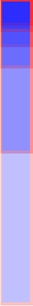
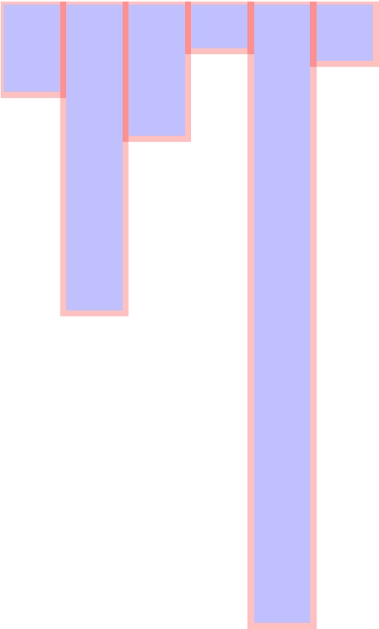
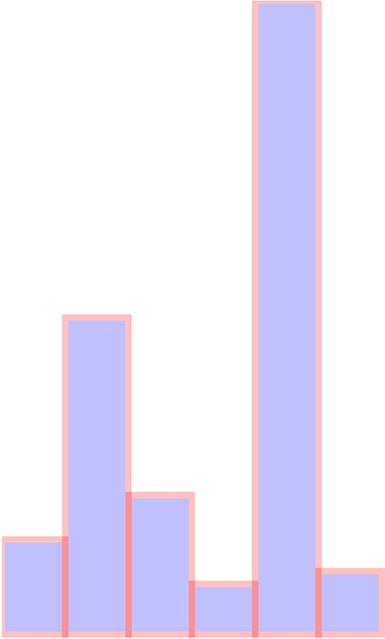
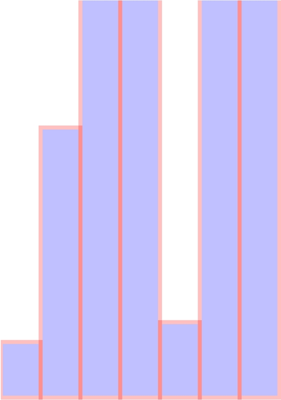
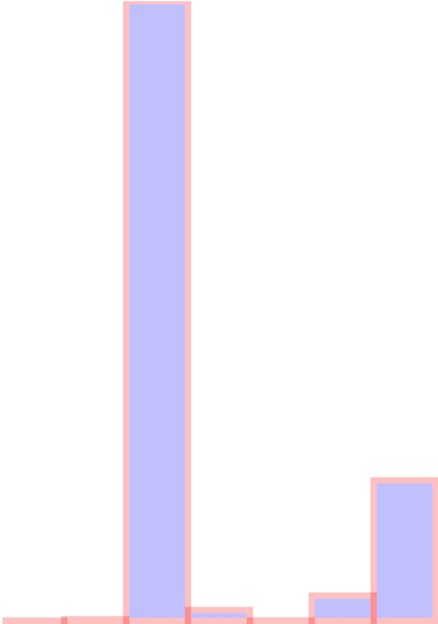
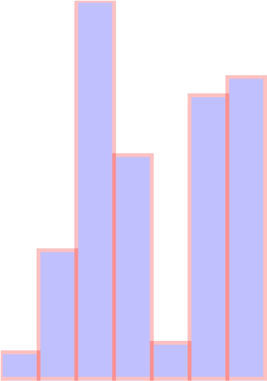
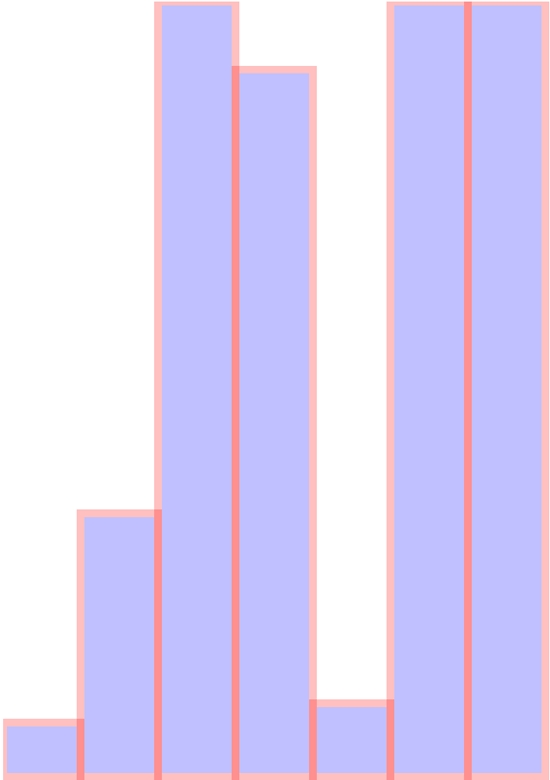

# Data Binding

- From this chapter, we will look into data binding, and how it creates and modifies elements
> Loading > Format > Evaluate(EDA) > **Create** > Update

## Selection and Binding
- The web structures and layers chages via selection in D3. 
- Selection consists of at least one DOM element and may have data relevant.
- Using `d3.select()...`  DOM element can either be created, modified, or deleted.
- The below is a sample of binding data to elements using 'cities.csv':
```java
d3.csv("cities.csv", function(error, data) {dataViz(data)});
function datavis(incomingData) {
	// An empty selection as there is no "cities" class in <div> element in <body>
	d3.select("body").selectAll("div.cities")
	  // Bind data to a selection
	  .data(incomingData)
	  // Define how to handle when there are more data than DOM element
	  .enter()
	  // Creates elements inside current selection
	  .append("div")
	  // Define class
	  .attr("class", "cities")
	  // Set contents within <div>
	  .html(function(d,i) {return d.label; });
}
// ref. to "Fig_02_11.html"
```
- Let's look at each command one by one:

### d3.selectAll()
- Selection process starts always with either `d3.select()` or `d3.selectAll()`
- An empty selection is returned when there is no element correspondant to parameter.
- Normally `enter()` mothod is being used to create element to be inserted.

### data()
- `data()` method links selection with array data.
- Each cities in dataset connects to DOM in selection, where data is saved to 'data' attribute.
- Via JavaScript, we can access to the data:
```java
// Return data of the first city, "San Francisco"
document.getElementsByClassName("cities")[0].__data__
// {label: "San Francisco", population: " 750000", country: "USA", x: "37", y: "-122"}
```

### enter() and exit()
- When there are more Data than DOM elements in selection, `enter()` repeats as many times as the Data.
- When there are more DOM elements in selection than Data, `exit()` method is being used.

### append() and insert()
- In general, there are more Data than DOM, and adds elements to DOM via `append()`.
- `insert()` is similar to `append()` but it can specify 'where' to add the element.

### attr()
- `attr()` adds attributes to elements created from `append()`.
- Dispite the fact that we had referenced as `.selectAll("div.cities")` previously, since it was an empty selection we need to create and add attributes. (*may need more study on this comment*)

### html()
- Contents to DOM will be set via `html()` method.


___
## In-line Functions to access data
- From a previous example, we can find that each dictionary set from data is assigned to '\<div\>'.
- That is because of the use of in-line function, and the function returns **index** and **data** where we notes **i** for index and **d** for data.
- From here after, we will be using "d3ia.html" for visualization samples via d3.
- Let us start with simple array with numbers `[15, 50, 22, 8, 100, 10]` and bar chart:
```java
var simpleArray = [15, 50 ,22, 8, 100, 10];

d3.select("body").append("svg");

d3.select("svg").selectAll("rect")
                .data(simpleArray)
                .enter()
                .append("rect")
                .attr("width", 10)
                .attr("height", function(d) {return d})
```
- It will return a bar filled in black, which is difficult to distinguish which part of bar represent the data.
- Should we change the code a little to control "opacity" and other style variables, it could be more informative:
```java
var simpleArray = [15, 50 ,22, 8, 100, 10];

d3.select("body").append("svg");

d3.select("svg").selectAll("rect")
                .data(simpleArray)
                .enter()
                .append("rect")
                .attr("width", 10)
                .attr("height", function(d) {return d})
// style attributes are added
                .style("fill", "blue")
                .style("stroke", "red")
                .style("stroke-width", "1px")
                .style("opacity", .25)
```
- This time, it returns a bar with different colors ('actually of same color, but bars are put on other bars and opacity makes the color look different') as below:  


- Still, the chart is difficult to tell, and need more adjustment such as rearranging x-axis:
```java
var simpleArray = [15, 50 ,22, 8, 100, 10];

d3.select("body").append("svg");

d3.select("svg").selectAll("rect")
                .data(simpleArray)
                .enter()
                .append("rect")
                .attr("width", 10)
                .attr("height", function(d) {return d})
                .style("fill", "blue")
                .style("stroke", "red")
                .style("stroke-width", "1px")
                .style("opacity", .25)
// adjust x-axis by assigning each data index * 10 for its x choordinate
                .attr("x", function(d,i) {return i *10})
```
  

- As we all are aware of, y-axis grows downward, and it displays figure unfamiliar to many of us:
```java
var simpleArray = [15, 50 ,22, 8, 100, 10];

d3.select("body").append("svg");

d3.select("svg").selectAll("rect")
                .data(simpleArray)
                .enter()
                .append("rect")
                .attr("width", 10)
                .attr("height", function(d) {return d})
                .style("fill", "blue")
                .style("stroke", "red")
                .style("stroke-width", "1px")
                .style("opacity", .25)
                .attr("x", function(d,i) {return i *10})
// make sure the graph (0,0) start from bottom-left
                .attr("y", function(d) {return 100-d})
```


### Data Scaling
- When the size of \<svg\> corresponds to the objects child to it, it is fair enough to visualize the way it is.
- However, in many cases, the variance of variables are quite large to draw in one screen.
- Drawing a graph with following data would not fully display the characteristics of data:
```java
//data variance is large (14~24500)
var simpleArray = [14, 68, 24500, 430, 19, 1000, 5555];

d3.select("body").append("svg");

d3.select("svg").selectAll("rect")
                .data(simpleArray)
                .enter()
                .append("rect")
                .attr("width", 10)
                .attr("height", function(d) {return d})
                .style("fill", "blue")
                .style("stroke", "red")
                .style("stroke-width", "1px")
                .style("opacity", .25)
                .attr("x", function(d,i) {return i *10})
                .attr("y", function(d) {return 100-d})
```


- Scaling comes in play, in such a case.
- `d3.scaleLinear().domain().range()` takes agmt that are within "domain range", and returns value that should fit into the "range given".
- In application, please refer to an example below:
```java
var simpleArray = [14, 68, 24500, 430, 19, 1000, 5555];

// sets scaling function
var simpleScaling = d3.scaleLinear().domain([0, 24500]).range([0, 100])

d3.select("body").append("svg");

d3.select("svg").selectAll("rect")
                .data(simpleArray)
                .enter()
                .append("rect")
                .attr("width", 10)
                .attr("height", function(d) {return simpleScaling(d)})
                .style("fill", "blue")
                .style("stroke", "red")
                .style("stroke-width", "1px")
                .style("opacity", .25)
                .attr("x", function(d,i) {return i *10})
                .attr("y", function(d) {return 100- simpleScaling(d)})
```


- It maybe more appropriate to use **polylinear scaling** when data variance is exceptionally large.
- It sets several points to the domain and range to display the relationship differently.
- From below example, it implies that there is meaningful observation from 0-100, 100-1000, and 1000+ (note that first range covers most from 0-50):
```java
var simpleArray = [14, 68, 24500, 430, 19, 1000, 5555];

// polylinear scaling
var simpleScaling = d3.scaleLinear().domain([0, 100, 1000, 24500]).range([0, 50, 75, 100])

d3.select("body").append("svg");

d3.select("svg").selectAll("rect")
                .data(simpleArray)
                .enter()
                .append("rect")
                .attr("width", 10)
                .attr("height", function(d) {return simpleScaling(d)})
                .style("fill", "blue")
                .style("stroke", "red")
                .style("stroke-width", "1px")
                .style("opacity", .25)
                .attr("x", function(d,i) {return i *10})
                .attr("y", function(d) {return 100- simpleScaling(d)})
```


- Data point exceeding certain range may not be so significant in cases.
- From our data, if response exceeding 500 means little, we can set "domain range" within 0-500:
```java
var simpleArray = [14, 68, 24500, 430, 19, 1000, 5555];

// adjust domain range
var simpleScaling = d3.scaleLinear().domain([0, 100, 500]).range([0, 50, 100])

d3.select("body").append("svg");

d3.select("svg").selectAll("rect")
                .data(simpleArray)
                .enter()
                .append("rect")
                .attr("width", 10)
                .attr("height", function(d) {return simpleScaling(d)})
                .style("fill", "blue")
                .style("stroke", "red")
                .style("stroke-width", "1px")
                .style("opacity", .25)
                .attr("x", function(d,i) {return i *10})
                .attr("y", function(d) {return 100- simpleScaling(d)})

simpleScaling(1000)
// returns 162.5
```
- Also note that scaling exceeding the "domain range" returns value exceeding the "range given".
- In order to prevent returning value exceeding "range given", `.clamp(true)` may be used:
```java
var simpleArray = [14, 68, 24500, 430, 19, 1000, 5555];

// adjust domain range
var simpleScaling = d3.scaleLinear().domain([0, 100, 500]).range([0, 50, 100]).clamp(true)

d3.select("body").append("svg");

d3.select("svg").selectAll("rect")
                .data(simpleArray)
                .enter()
                .append("rect")
                .attr("width", 10)
                .attr("height", function(d) {return simpleScaling(d)})
                .style("fill", "blue")
                .style("stroke", "red")
                .style("stroke-width", "1px")
                .style("opacity", .25)
                .attr("x", function(d,i) {return i *10})
                .attr("y", function(d) {return 100- simpleScaling(d)})

simpleScaling(1000)
// returns 100
```
