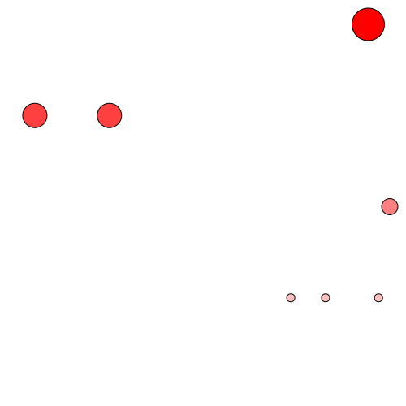
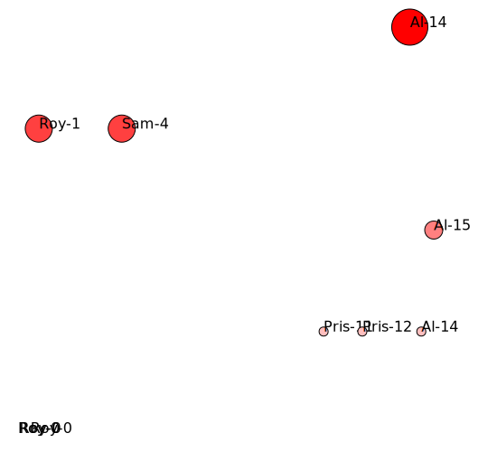
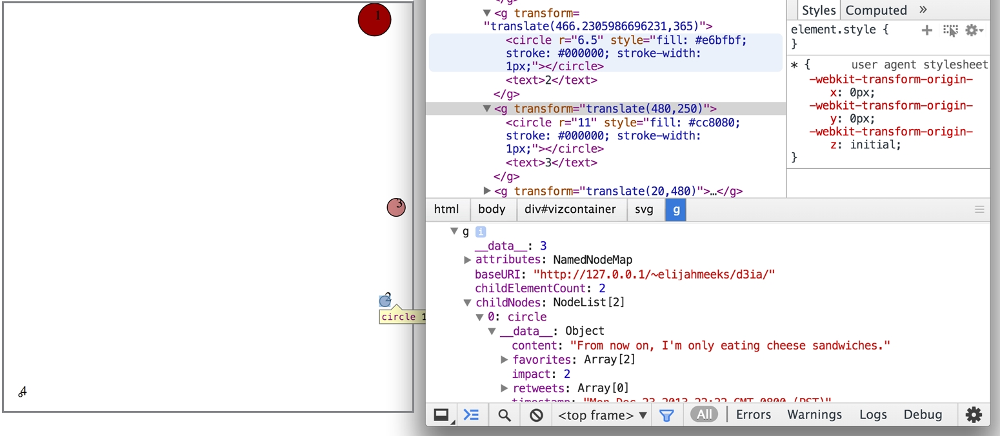

# Styling, attributes, contents

> ## Before we move on (d3.csv in D3_v4 and D3_v5)
> D3 now uses Promises instead of asynchronous callbacks to load data. Promises simplify the structure of asynchronous code, especially in modern browsers that support async and await. (See this introduction to promises on Observable.) For example, to load a CSV file in v4, you might say:

```java
d3.csv("file.csv", function(error, data) {
  if (error) throw error;
  console.log(data);
});
```

> In v5, using promises:

```java
d3.csv("file.csv").then(function(data) {
  console.log(data);
});
```
> Note that you don’t need to re-throw the error—the promise will reject automatically, and you can promise.catch if desired. Using await, the code is even simpler:


## Visualization from the data loaded

- When data is processed and contains only the quantitative values, it is easy to construct a chart.
- Scaling with `d3.max()` makes everything so easy and comfortable.

```java
d3.csv("cities.csv")
  .then(function(incomingData) {
// For D3 v4 or ealier, please use below;
// d3.csv("cities.csv", function(error,data) {dataViz(data);});
// function dataViz(incomingData) {
    
    // from population from element from incomingData 
	var maxPopulation = d3.max(incomingData, function(el) {
		// population value to int
		return parseInt(el.population);
	});

	var yScale = d3.scaleLinear().domain([0, maxPopulation]).range([0,460]);
	d3.select("svg").attr("style", "height: 480px; width: 600px;");
	d3.select("svg")
	  .selectAll("rect")
	  .data(incomingData)
	  .enter()
	  .append("rect")
	  .attr("width", 50)
	  .attr("height", function(d) {return yScale(parseInt(d.population));})
	  .attr("x", function(d,i) {return i * 60;})
	  .attr("y", function(d) {return 480 - yScale(parseInt(d.population));})
	  .style("fill", "blue")
	  .style("stroke", "red")
	  .style("stroke-width", "1px")
	  .style("opacity", .25);
}
```


- In order to use `tweets.json`, and see how many postings are made per person, we need to use `d3.nest()` to manipulate data a little.

```java
d3.json("tweets.json")
  .then(function(incomingData){

  	var nestedTweets = d3.nest()
  	                     .key(function(el) {
                             return el.user;
                         })
  	                     .entries(incomingData.tweets);
      
    nestedTweets.forEach(function (el) {
    	el.numTweets = el.values.length;
    })

    var maxTweets = d3.max(nestedTweets, function(el) {
    	return el.numTweets;
    })

    var yScale = d3.scaleLinear().domain([0,maxTweets]).range([0,100])

    d3.select("svg")
      .selectAll("bar")
      .data(nestedTweets)
      .enter()
      .append("rect")
      .attr("width", 50)
      .attr("height", function(d) {return yScale(d.numTweets)})
      .attr("x", function (d,i) {return i * 60;})
      .attr("y", function (d) {return 100 - yScale(d.numTweets)})
      .style("fill", "blue")
      .style("stroke-width", "1px")
      .style("stroke", "red")
      .style("opacity", .25)

 })
```


## Configure Channels

- We have been using single variables to visualize (the height of rectangle)

- Where in real life, many independent variables explain a dependent variable, that is **multivariate**

  > - Each variable represent **channel** in visualization that defines *height, width, area, color, location, shape, and etc*
  > - When using multiple channels to explain dependent variable, be careful not to show too many information.

- Back to `tweets.json`, we will have a new graph showing "the time of the tweet" on X-axis, "implication of tweet" on Y-axis, color and size.

```java
d3.select("svg")
  .attr("width", 500)
  .attr("height", 500)

d3.json("tweets.json")
  .then(function(incomingData){

      // json data is stored under tweets
      var eda = incomingData.tweets
      // modify and add new value to dataset
      eda.forEach(function (el) {
          // impact value
          el.impact = el.favorites.length + el.retweets.length;
          // str to date
          el.tweetTime = new Date(el.timestamp);
      })
      
          
      var maxImpact = d3.max(eda, function(el) {return el.impact;});
      var startEnd = d3.extent(eda, function(el) {return el.tweetTime;});
      
      // scaling
      var timeRamp = d3.scaleTime().domain(startEnd).range([20,480]);
      var yScale = d3.scaleLinear().domain([0,maxImpact]).range([1,450]);
      var radiusScale = d3.scaleLinear().domain([0,maxImpact]).range([0,20]);
      var colorScale = d3.scaleLinear().domain([0,maxImpact]).range(["white","red"]);
      
      d3.select("svg")
          .selectAll('circles')
          .data(eda)
          .enter()
          .append('circle')
          .attr('r',function(d){return radiusScale(d.impact);})
          .attr('cx', function(d){return timeRamp(d.tweetTime);})
          .attr("cy", function(d){return 480 - yScale(d.impact);})
          .style("fill", function(d){return colorScale(d.impact);})
          .style("stroke", "black")
          .style("stroke-width", '1px')
      });  
```



## enter(), update(), exit()

- As explained a few times earlier, when there are more data than DOM element, `selection.enter()` method is being used, while `selection.exit()` is used when there are more DOM than data
- When `enter()` or `exit()` method has been called, child elements are effected: for SVG element, `<svg>`, `<g>`, `<text>`.
- If we were to create similar diagram with `<g>` it should look something like below;

```java
d3.select("svg")
  .attr("width", 550)
  .attr("height", 500)

d3.json("tweets.json")
  .then(function(incomingData){

      var eda = incomingData.tweets
      eda.forEach(function (el) {
          el.impact = el.favorites.length + el.retweets.length;
          el.tweetTime = new Date(el.timestamp);
      })
      
      var maxImpact = d3.max(eda, function(el) {return el.impact;});
      var startEnd = d3.extent(eda, function(el) {return el.tweetTime;});
      
      var timeRamp = d3.scaleTime().domain(startEnd).range([20,480]);
      var yScale = d3.scaleLinear().domain([0,maxImpact]).range([1,450]);
      var radiusScale = d3.scaleLinear().domain([0,maxImpact]).range([0,20]);
      var colorScale = d3.scaleLinear().domain([0,maxImpact]).range(["white","red"]);
      
      // instead of going # of <circle> element, group them with <g>
      var tweetG = d3.select("svg").selectAll("g")
                     .data(eda)
                     .enter()
                     .append("g")
                     // <g> takes str-type attributes: assign coordinates from <g>
                     .attr("transform", function(d){
                         return "translate(" +
                         timeRamp(d.tweetTime) +
                         "," +
                         (480 - yScale(d.impact)) +
                         ")";
               })
      // cx, cy defined from <g>
      tweetG.append("circle")
            .attr("r", function(d) {return radiusScale(d.impact);})
            .style("fill", function(d){return colorScale(d.impact);})
            .style("stroke", "black")
            .style("storke-width", "1px");

      // add tweet user and posting-time
      tweetG.append("text")
            .text(function(d) {return d.user + "-" + d.tweetTime.getHours()})
})
```




### `exit()` & `update()`

- Just as we chain command like `enter().append()`, `exit()`, goes along with `remove()`.
- Unless `style()` and `attr()` are used, attributes of DOM do not change
- If we want to changes texts within the diagram, we can use `update()` method.

```java
d3.selectAll("g")
  .data([1,2,3,4])
  .exit()
  .remove()
    
d3.selectAll("g")
  .select("text")
  .text(function(d) {return d});
```



- Some DOM elements have been removed, impact texts have been modified.
- However, NOTE that the texts has not been properly replaced to imply impact of tweets 

```javascript
d3.selectAll("g").each(function(d) {console.log(d)})
// VM731:1 1
// VM731:1 2
// VM731:1 3
// VM731:1 4

d3.selectAll("text").each(function(d) {console.log(d)})
// VM731:3 1
// VM731:3 2
// VM731:3 3
// VM731:3 4

d3.selectAll("circle").each(function(d) {console.log(d)})
// VM731:5 {user: "Al", content: "I really love seafood.", timestamp: " Mon Dec 23 2013 21:30 GMT-0800 (PST)", retweets: Array(3), favorites: Array(1), …}
// VM731:5 {user: "Al", content: "I take that back, this doesn't taste so good.", timestamp: "Mon Dec 23 2013 21:55 GMT-0800 (PST)", retweets: Array(1), favorites: Array(0), …}
// VM731:5 {user: "Al", content: "From now on, I'm only eating cheese sandwiches.", timestamp: "Mon Dec 23 2013 22:22 GMT-0800 (PST)", retweets: Array(0), favorites: Array(2), …}
// VM731:5 {user: "Roy", content: "Great workout!", timestamp: " Mon Dec 23 2013 7:20 GMT-0800 (PST)", retweets: Array(0), favorites: Array(0), …}
```

- `exit()` method is to eliminate bound array not to assign new value, but since `data()` method assign values based on data order.
- So, the data `[1,2,3,4]` is bound to the data, and other child DOM follows `exit()` method and eleminated.
- However, in many cases, order is less important and key-values carry the greater importance, which needs to be used as binding key.
- In order to do so, we need to fist **`stringify()`** object as binding key requires data type string or int.

```javascript
d3.select("svg")
  .attr("width", 550)
  .attr("height", 500)

d3.json("tweets.json")
  .then(function(incomingData){

      var eda = incomingData.tweets
      eda.forEach(function (el) {
          el.impact = el.favorites.length + el.retweets.length;
          el.tweetTime = new Date(el.timestamp);
      })
      
          
      var maxImpact = d3.max(eda, function(el) {return el.impact;});
      var startEnd = d3.extent(eda, function(el) {return el.tweetTime;});
      
      var timeRamp = d3.scaleTime().domain(startEnd).range([20,480]);
      var yScale = d3.scaleLinear().domain([0,maxImpact]).range([1,450]);
      var radiusScale = d3.scaleLinear().domain([0,maxImpact]).range([0,20]);
      var colorScale = d3.scaleLinear().domain([0,maxImpact]).range(["white","red"]);
      
      d3.select("svg")
          .selectAll('circles')
          // Need unique values for key
          .data(eda, function(d){
            return JSON.stringify(d)})
          .enter()
          .append('circle')
          .attr('r',function(d){return radiusScale(d.impact);})
          .attr('cx', function(d){return timeRamp(d.tweetTime);})
          .attr("cy", function(d){return 480 - yScale(d.impact);})
          .style("fill", function(d){return colorScale(d.impact);})
          .style("stroke", "black")
          .style("stroke-width", '1px')
    
    // filter dataset where impact is greater than 0
    var filteredData = eda.filter(
      function(el) {return el.impact > 0});
    
    // apply filtered data and remove insignificant data
    d3.selectAll("circle")
      .data(filteredData, function(d) {return JSON.stringify(d)})
      .exit()
      .remove();
    
      });  
```

- The outcome eliminates circle DOM with with 'r = "0"'

```html
<svg width="550" height="500">
    <circle r="20" cx="453.48115299334813" cy="30" style="fill: rgb(255, 0, 0); stroke: black; stroke-width: 1px;"></circle>
    <circle r="5" cx="466.2305986696231" cy="366.75" style="fill: rgb(255, 191, 191); stroke: black; stroke-width: 1px;"></circle>
    <circle r="10" cx="480" cy="254.5" style="fill: rgb(255, 128, 128); stroke: black; stroke-width: 1px;"></circle>
    <circle r="15" cx="42.949002217294904" cy="142.25" style="fill: rgb(255, 64, 64); stroke: black; stroke-width: 1px;"></circle>
    <circle r="5" cx="358.1152993348115" cy="366.75" style="fill: rgb(255, 191, 191); stroke: black; stroke-width: 1px;"></circle>
    <circle r="5" cx="400.95343680709533" cy="366.75" style="fill: rgb(255, 191, 191); stroke: black; stroke-width: 1px;"></circle>
    <circle r="15" cx="134.7450110864745" cy="142.25" style="fill: rgb(255, 64, 64); stroke: black; stroke-width: 1px;"></circle>
</svg>
```

- If we do not `stringify()` the data, it eliminates data in order, not by the filter rule.
- If we look into the `filteredData` it contains the following dataset;

```javascript
console.log(filteredData)

// 0: {user: "Al", content: "I really love seafood.", timestamp: " Mon Dec 23 2013 21:30 GMT-0800 (PST)", retweets: Array(3), favorites: Array(1), …}
//1: {user: "Al", content: "I take that back, this doesn't taste so good.", timestamp: "Mon Dec 23 2013 21:55 GMT-0800 (PST)", retweets: Array(1), favorites: Array(0), …}
//2: {user: "Al", content: "From now on, I'm only eating cheese sandwiches.", timestamp: "Mon Dec 23 2013 22:22 GMT-0800 (PST)", retweets: Array(0), favorites: Array(2), …}
//3: {user: "Roy", content: "Just got a ticket for texting and driving!", timestamp: " Mon Dec 23 2013 8:05 GMT-0800 (PST)", retweets: Array(0), favorites: Array(3), …}
//4: {user: "Pris", content: "Going to have some boiled eggs.", timestamp: " Mon Dec 23 2013 18:23 GMT-0800 (PST)", retweets: Array(0), favorites: Array(1), …}
//5: {user: "Pris", content: "Maybe practice some gymnastics.", timestamp: " Mon Dec 23 2013 19:47  GMT-0800 (PST)", retweets: Array(0), favorites: Array(1), …}
//6: {user: "Sam", content: "@Roy Let's get lunch", timestamp: " Mon Dec 23 2013 11:05 GMT-0800 (PST)", retweets: Array(1), favorites: Array(2), …}
```


> ## Topics covered
>
> - Load data in CSV or JSON format
> - Manipulate data using D3 `scale()` and other javascript functions
> - Bind data to visualize
> - Created \<g\> element to select multiple elements
> - Create, remove, and update values using `enter()`, `exit()`