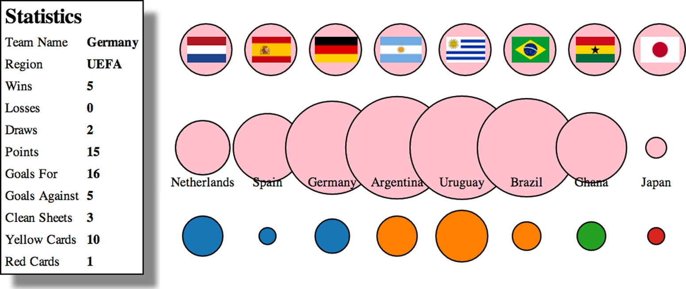

# Structure data and interaction

> ## Topics to be covered
> 1. Add interaction to graphic elements
> 2. Effectively use colors
> 3. Pop-up conventional HTML
> 4. Insert external SVG icons
>
> ## Expected output
>
> - We are going to use `worldcup.csv` that contains statistics from 2010 worldcup to draw below chart.
>
> 


## Project architecture

- When the purpose of visualization is a static webpage, then there is little need to consider data structure.
- However, when the purpose of visualization is with dynamic application and interactions, the project needs to be precisely planned in advance.

### Data

- Data is available via server API, either in static or dynamic.
- We are going to access the world cup data via interactive dynamic method.

### Resource

- External SVG or HTML components needs to be loaded separatly.

### Picture

- Flag PNG files will be used to describe nationalities.

### Style-sheet

- CSS compiler support CSS variables and other applications.
- The list below explains various class to SVG components.

```css
text{
    font-size: 10px;
}

g > text.active {
    font-size: 30px;
}

circle {
    fill: pink;
    stroke: black;
    stroke-width: 1px;
}

circle.active {
    fill: red;
}

circle.inactive{
    fill: gray
}
```

### External Library

- We will be using `soccerviz.js`(user-defined library),  and `colorbrewer.js`(D3 bundle library for color pallette).
- `d3_c.html` references the two libraries stated above, and \<body\> has onload attributes to load `soccerviz.js`.

```html
<!DOCTYPE html><meta charset="utf-8">
<html>
  <head>
    <title>D3 in Action Example</title>
    <meta charset='utf-8' />
    <link type="text/css" rel="stylesheet" href="d3ia.css" />
  </head>
  <script src="https://d3js.org/d3.v5.min.js" type="text/JavaScript"></script>
  <script src="Source/colorbrewer.js" type="text/javascript"></script>
  <script src="soccerviz.js" type="text/javascript"></script>
  <body onload="createSoccerViz()">
  	<div id="viz">
      <svg style = "width:500px; height:500px;border:1px lightgray solid;" />
  	</div>
    <div id="controls" />
  </body>
</html>
```

- `soccerviz.js` loads and binds data to create pink circles with labels.

```javascript
function createSoccerViz() {
	//데이터를 로딩하고 로딩된 데이터로 overallTeamViz() 함수를 호출
	d3.csv("worldcup.csv")
	  .then(function(data){
	  	overallTeamViz(data);
	  })

	function overallTeamViz(incomingData) {
		//팀별로 <g>를 만들어 레이블을 붙인다. 나중에 더 많은 요소를 추가한다.
		d3.select("svg")
		  .append("g")
		  .attr("id", "teamsG")
		  .attr("transform", "translate(50,300)")
		  .selectAll("g")
		  .data(incomingData)
		  .enter()
		  // <svg>요소에 <g>그룹을 추가하고 자신의 콘텐츠를 중앙으로 이동시킨다.
		  .append("g")
		  .attr("class", "overallG")
		  .attr("transform", function(d,i) {return "translate("+(i*50)+",0)"});

		// d3.selectAll() 반복 방지를 위해 변수로 할당
		var teamG = d3.selectAll("g.overallG")
		teamG.append("circle")
		     .attr("r", 20)
		     .style("fill", "pink")
		     .style("stroke", "black")
		     .style("stroke-width", "1px");

		teamG.append("text")
		     .style("text-anchor", "middle")
		     .attr("y", 30)
		     .style("font-size", "10px")
		     .text(function(d) {return d.team})

	}
}
```


> ## Topics covered
>
> - Load data in CSV or JSON format
> - Manipulate data using D3 `scale()` and other javascript functions
> - Bind data to visualize
> - Created \<g\> element to select multiple elements
> - Create, remove, and update values using `enter()`, `exit()`