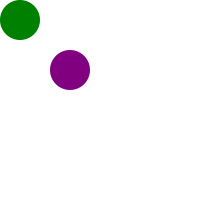
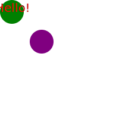

# SVG Text Element


## The Goal
- Understand SVG Text Element and how to use
- Understand how SVG Text Element works
- Use SVG Text Element using D3.js


## SVG Text Element
- Pretty much self explanatory, the SVG Text Element defines a graphics element consisting of text.
- Attributes and properties that defines SVG Text Element includes: font, writing direction, color, etc.
- A sample SVG Text Element would look like:
```html
<text x="20" y="20" font-family="sans-serif" font-size="20px" fill = "red">Hello!</text>
```
- It tells us to draw "Hello!" at point (20,20), with font-family sans-serif, with font-size of 20px, and fill color of red.


## Adding an SVG Text Element
- The baseline will be a container with two circles:
```html
<svg width="200" height="200">
  <circle cx="20" cy="20" r="20" fill="green" />
  <circle cx="70" cy="70" r="20" fill="purple" />
</svg>
```

- In order to add text onto the green cicle, we can use SVG Text Element.
- As we know the center point of green circle (20,20), we can write the SVG Text Element as follows:
```html
<svg width="200" height="200">
  <circle cx="20" cy="20" r="20" fill="green" />
  <circle cx="70" cy="70" r="20" fill="purple" />
  // adding an SVG Text element
  <text x="20" y="20" font-family="sans-serif" font-size="20px" text-anchor="middle" fill = "red">Hello!</text>
</svg>
```

- We were able to center the SVG Text Elment around the point(20,20)
- However, the "Hello!" has been cut to the left-had side, as the Viewport cuts off any SVG elment outside of its boundary


## SVG Text Element and D3.js
- The above baseline example can be put it this way in D3.js console:
```java
var circleData = [
  {"cx": 20, "cy":20, "radius": 20, "color": "green"},
  {"cx": 70, "cy":70, "radius": 20, "color": "purple"}
];


var svgContainer = d3.select("body").append("svg")
                                    .attr("width", 200)
                                    .attr("height", 200);


var circles = svgContainer.selectAll("circle")
                          .data(circleData)
                          .enter()
                          .append("circle");


var createCircle = circles.attr("cx", function(d){return d.cx})
                          .attr("cy", function(d){return d.cy})
                          .attr("r", function(d){return d.radius})
                          .style("fill", function(d){return d.color});
```
- Which returns:

- The text element works the same
- It needs to bind data to SVG Text DOM, and use functions to return relevant data to draw text
```java
var svgText = svgContainer.selectAll("unknowns")
                          .data(circleData)
                          .enter()
                          .append("text")


var createText = svgText.attr("x", function(d){return d.cx})
                        .attr("y", function(d){return d.cy})
                        .attr("font-family", "sans-serif")
                        .attr("fill", "red")
                        .attr("font-size", "20px")
                        .text("Hello")
                      //.text( function(d){return "(" + d.cx + "," + d.cy + ")" }) to return coordinate "(20,20)"" instead of "Hello"

```
- Should we put all together, the final code would look like:
```java
var circleData = [
  {"cx": 20, "cy":20, "radius": 20, "color": "green"},
  {"cx": 70, "cy":70, "radius": 20, "color": "purple"}
];


var svgContainer = d3.select("body").append("svg")
                                    .attr("width", 200)
                                    .attr("height", 200);


var circles = svgContainer.selectAll("circle")
                          .data(circleData)
                          .enter()
                          .append("circle");


var createCircle = circles.attr("cx", function(d){return d.cx})
                          .attr("cy", function(d){return d.cy})
                          .attr("r", function(d){return d.radius})
                          .style("fill", function(d){return d.color});


var svgText = svgContainer.selectAll("unknowns")
                          .data(circleData)
                          .enter()
                          .append("text")


var createText = svgText.attr("x", function(d){return d.cx})
                        .attr("y", function(d){return d.cy})
                        .attr("font-family", "sans-serif")
                        .attr("fill", "red")
                        .attr("font-size", "20px")
                      //.text("Hello")
                        .text( function(d){return "(" + d.cx + "," + d.cy + ")" }) //to return coordinate "(20,20)"" instead of "Hello"

```
It should return:
