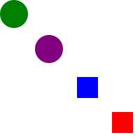
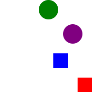

# SVG Group Element and D3.js


## The Goal
- Define what the SVG Group Element is and how to use
- Use SVG Group Element manually
- Demonstrate how D3.js works with the SVG Group Element


## SVG Group Element
- SVG Group Element is used to group SVG elements together where it is defined by **<g>** and **</g>**
- It can be nested inside of other SVG Group Elements:
```html
<g>
  <g>
  ...
  </g>
</g>
```
- If any transformation applied to the SVG Group Element is applied to all of the child element contained inside

- The major uses of the SVG Group Element are:
> 1. **Grouping** - to group a set of SVG elements that share the same attr.
> 2. **Transforming** - To define a new coordinate system for a set of SVG elements by applying a transformation to each coordinate specified


## Grouping SVG Elements Together
- The example will start with 4 SVG Basic Shape Elements with 2 circles and 2 rectangles:
```html
<svg width="200" height="200">
  <circle cx="20" cy="20" r="20" fill="green" />
  <rect x="110" y="110" height="30" width="30" fill="blue" />
  <circle cx="70" cy="70" r="20" fill="purple" />
  <rect x="160" y="160" height="30" width="30" fill="red" />
</svg>
```
- It works fine, but it is very difficult to decipher what is happening.
- With SVG Group element, the code can be organized and easier to read:
```html
<svg width="200" height="200">
  <g>
    <circle cx="20" cy="20" r="20" fill="green" />
    <circle cx="70" cy="70" r="20" fill="purple" />
  </g>
  <g>
    <rect x="110" y="110" height="30" width="30" fill="blue" />
    <rect x="160" y="160" height="30" width="30" fill="red" />
  </g>
</svg>
```



## Transforming SVG Elements Together (Part 1)
- If we wanted to move circles 80 unites to the right, then we can simply add 80 units to the **cx** attribute:
```html
<svg width="200" height="200">
  <g>
    <circle cx="100" cy="20" r="20" fill="green" />
    <circle cx="150" cy="70" r="20" fill="purple" />
  </g>
  <g>
    <rect x="110" y="110" height="30" width="30" fill="blue" />
    <rect x="160" y="160" height="30" width="30" fill="red" />
  </g>
</svg>
```

- However, that is not exactly what we expected for a solution, where we use SVG Group element


## SVG Transform Attribute
- The SVG Transform Attribute applies a list of transformations to an element like:
```html
<svg width="200" height="200">

  // This way:
  <g transform="translate(...) scale(...) rotrate(...) translate(...) rotate(...)">
  ...
  </g>


  // or this way works the same:
  <g transform = "translate(...)">
    <g transform = "scale(...)">
      <g transform = "rotate(...)">
        <g transform = "translate(...)">
          <g transform = "rotate(...)">
          ...
          </g>
        </g>
      </g>
    </g>
  </g>

</svg>
```
- There are 6 types of transformation available:
>1. matrix(<a> <b> <c> <d> <e> <f>): transformation matrix of six values
>2. translate(<x> [<y>]): translation by x and y. If y not given, it is assumed to be zero
>3. scale(<x> [<y>]): scale operation by x and y. If y not given, it is assumed to be same as x
>4. skewX(<a>): skew transformation along the X axis by a degrees
>5. skewY(<a>): skew transformation along the Y axis by a degrees


## Transformaing SVG Elements Together (Part 2)
- Instead of changing values inside SVG objects, we can group transform now
- Using the first example, we can add a code to shift circles by 80 units:
```html
<svg width="200" height="200">
  <g transform = "translate(80,0)">
    <circle cx="20" cy="20" r="20" fill="green" />
    <circle cx="70" cy="70" r="20" fill="purple" />
  </g>
  <g>
    <rect x="110" y="110" height="30" width="30" fill="blue" />
    <rect x="160" y="160" height="30" width="30" fill="red" />
  </g>
</svg>
```

- If we use the `transform` method, interestingly the *cx* values **do not change**

